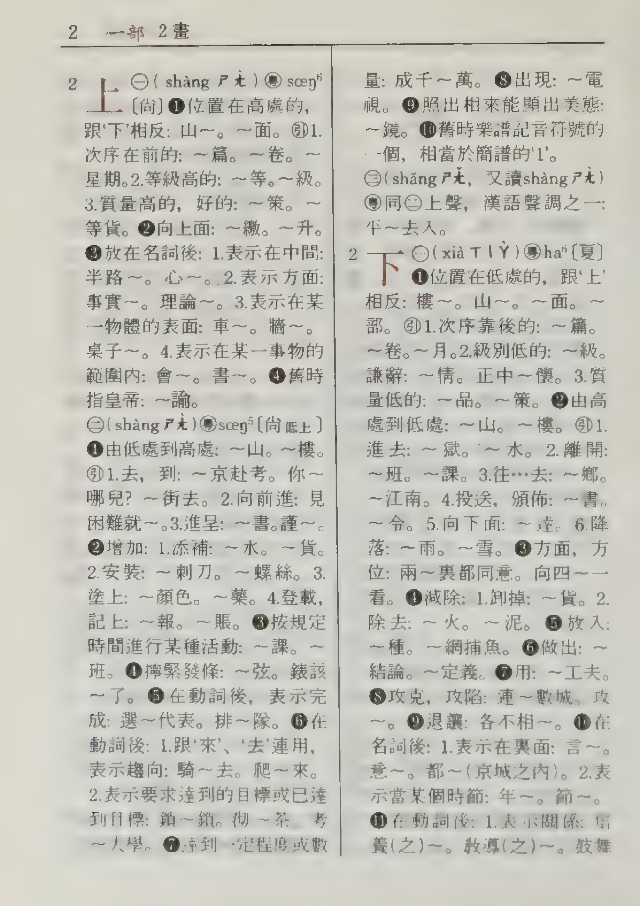
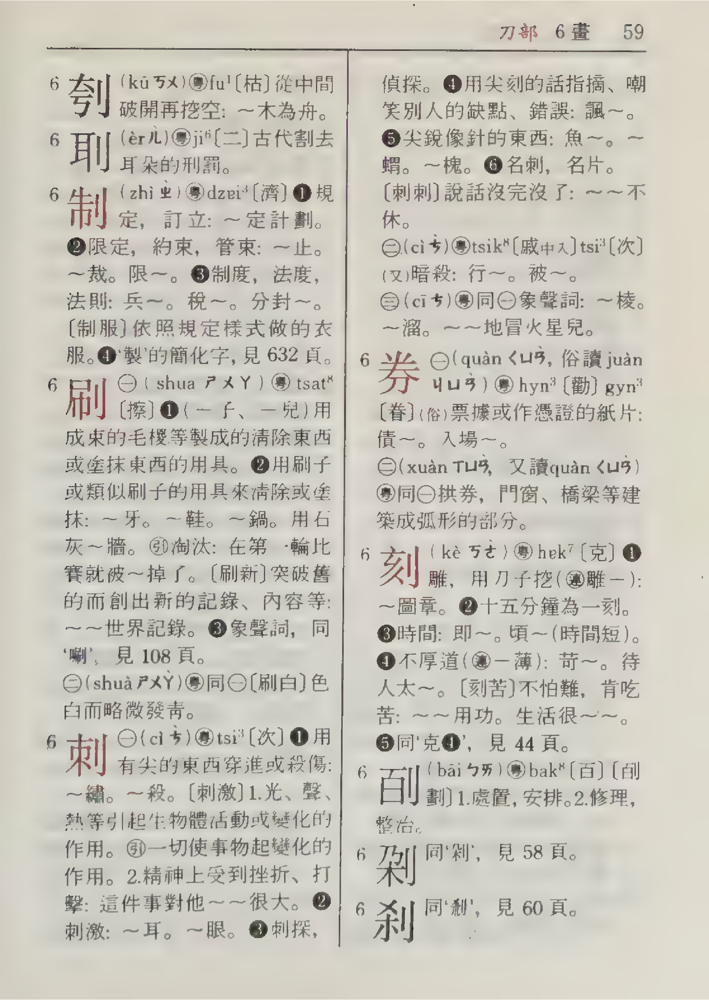
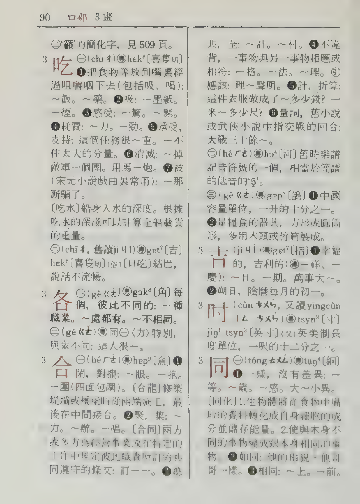
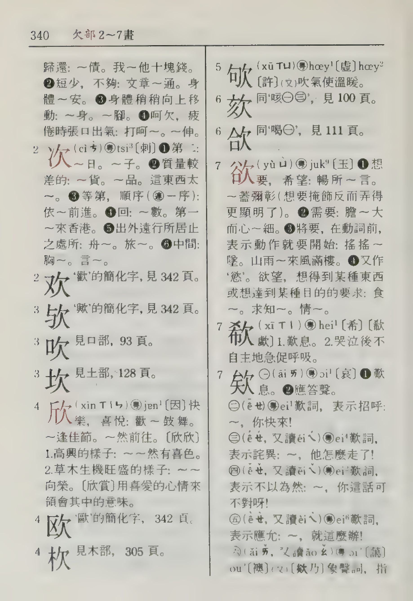
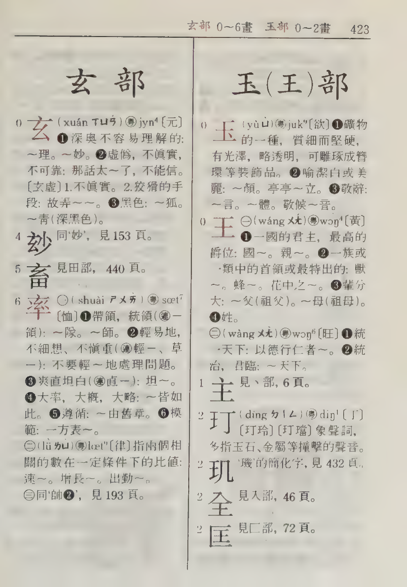
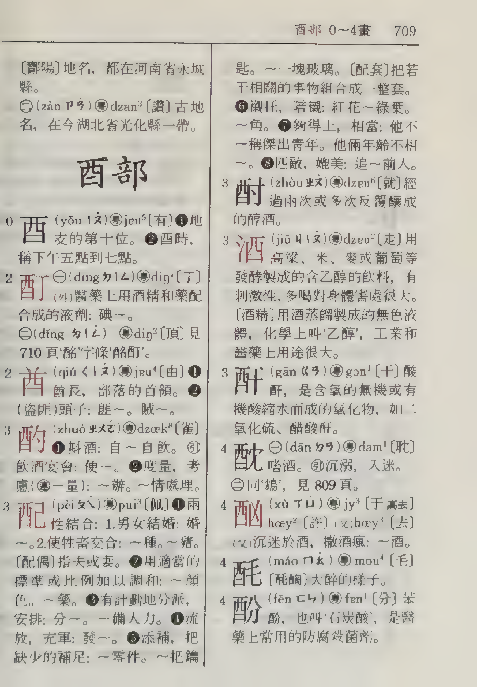

# Parser functions

Much of the logic of this program consists of small parser functions, each of which takes an entry in the Unihan database and return a list of `Insertion`s. My guiding light in writing the function for each Unihan property is [Unicode® Standard Annex #38](https://www.unicode.org/reports/tr38/index.html) (SA38). The sections below offer further details in cases where the behaviour of the parser functions may not be obvious.

## IRG sources

## `kCNS19{86,92}`

[Chinese Standard Interchange Code (CSIC) - Set 1](https://itscj.ipsj.or.jp/ir/171.pdf)

## `kMainlandTelegraph`

I gather from the [Chinese commercial/telegraph code lookup](http://www.njstar.com/tools/telecode/) tool linked from the Japanese Wikipedia page for Chinese telegraph codes ([<span lang="ja-JP">電碼</span>](https://ja.wikipedia.org/wiki/%E9%9B%BB%E7%A2%BC)) that leading zeros in codes are meaningful. For this reason, `kMainlandTelegraph` values are stored as `text`, rather than `integer`.


## `kSMSZD2003Readings`

Each entry for this property in the Unihan database comprises one or more space-separated combinations of Mandarin and Cantonese readings for the ideograph in question. Each combination contains one or more Mandarin readings and one or more Cantonese readings, where the dialects are separated by the character '<span lang="zh-Hant-HK">粵</span>', and readings within a dialect are separated by commas.

An inspection of the source of this Unihan property, the Soengmou San Zidin (SMSZD, <span lang="zh-Hant-HK">商務新字典</span>, New Commercial Press Character Dictionary), shows that a combination of readings in the database corresponds to the pronunciation(s) given for a group of definitions numbered <span lang="zh-Hant-HK">㊀</span>, <span lang="zh-Hant-HK">㊁</span>, etc. Within a combination, multiple pronunciations in a single dialect are occasionally marked <span lang="zh-Hant-HK">又讀</span> ('also read'), <span lang="zh-Hant-HK">俗讀</span> ('commonly read'), etc., which information is not preserved in the Unihan database.

In the simplest case of a combination consisting of one Mandarin reading and one Cantonese reading, the correspondence between readings is obvious. Things get more complicated in cases of combinations with two readings in either dialect. When there is only a single reading in one dialect, I consider it to mean that all the readings in the other dialect correspond to that one reading. For instance, in the `shǎng,shàng粵soeng5` example below, I take the meaning to be 'the Mandarin readings *shǎng* and *shàng* each correspond to Cantonese *soeng5*'.

In cases with two Mandarin and two Cantonese readings, I consider the first Mandarin reading to correspond to the first Cantonese reading, and the second to the second. So in the case of `quàn,juàn粵hyun3,gyun3`, I understand '*quàn* corresponds to *hyun3*, and *juàn* to *gyun3*'.

This scheme would be complicated by a combination of, e.g., two Mandarin and three Cantonese readings. Fortunately, no such combination exists: the closest is <span lang="zh-Hant-HK">酗</span>, detailed below, which has one Mandarin reading and three Cantonese.

I preserve the <span lang="zh-Hant-HK">㊀</span>, <span lang="zh-Hant-HK">㊁</span> numbering in the `definitionPriority` column and the order of readings within a combination in the `readingPriority` column.

### Examples

The pages below are scans of SMSZD. Full bibliographic information is found in the description of [`kSMSZD2003Index`](https://www.unicode.org/reports/tr38/index.html#kSMSZD2003Index) in SA38. Please note that the scans are from the 1993 fifth printing of the 1991 first edition, rather than the 2003 edition on which the Unihan database is based. A notable difference is that Cantonese readings in the earlier edition are given in IPA, whereas the `kSMSZD2003Readings` values use Jyutping.

The database results are the product of the following query, where `X` is replaced by the character in question:

```SQL
SELECT mandarin,
       cantonese,
       definitionPriority,
       readingPriority
FROM kSMSZD2003ReadingsTable
INNER JOIN utf8Table USING (code)
WHERE utf8 = 'X'
ORDER BY definitionPriority,
         readingPriority;
```

#### <span lang="zh-Hant-HK">上</span>



Entry: `U+4E0A	kSMSZD2003Readings	shàng粵soeng6 shàng粵soeng5 shǎng,shàng粵soeng5`

Results:

| mandarin | cantonese | definitionPriority | readingPriority |
|----------|-----------|--------------------|-----------------|
| shàng    | soeng6    | 1                  | 1               |
| shàng    | soeng5    | 2                  | 1               |
| shǎng    | soeng5    | 3                  | 1               |
| shàng    | soeng5    | 3                  | 2               |

#### <span lang="zh-Hant-HK">券</span>



Entry: `U+5238	kSMSZD2003Readings	quàn,juàn粵hyun3,gyun3 xuàn,quàn粵hyun3,gyun3`

Results:

| mandarin | cantonese | definitionPriority | readingPriority |
|----------|-----------|--------------------|-----------------|
| quàn     | hyun3     | 1                  | 1               |
| juàn     | gyun3     | 1                  | 2               |
| xuàn     | hyun3     | 2                  | 1               |
| quàn     | gyun3     | 2                  | 2               |

#### <span lang="zh-Hant-HK">吃</span>



Entry: `U+5403	kSMSZD2003Readings	chī粵hek3 chī,jī粵gat1,kek3`

Results:

| mandarin | cantonese | definitionPriority | readingPriority |
|----------|-----------|--------------------|-----------------|
| chī      | hek3      | 1                  | 1               |
| chī      | gat1      | 2                  | 1               |
| jī       | kek3      | 2                  | 2               |

#### <span lang="zh-Hant-HK">欸</span>



Entry: `U+6B38	kSMSZD2003Readings	āi粵oi1 ê̄粵ei1 ế,éi粵ei4 ê̌,ěi粵ei2 ề,èi粵ei6 ǎi,ǎo粵oi2,ou2`

Results:

| mandarin | cantonese | definitionPriority | readingPriority |
|----------|-----------|--------------------|-----------------|
| āi       | oi1       | 1                  | 1               |
| ê̄       | ei1       | 2                  | 1               |
| ế        | ei4       | 3                  | 1               |
| éi       | ei4       | 3                  | 2               |
| ê̌       | ei2       | 4                  | 1               |
| ěi       | ei2       | 4                  | 2               |
| ề        | ei6       | 5                  | 1               |
| èi       | ei6       | 5                  | 2               |
| ǎi       | oi2       | 6                  | 1               |
| ǎo       | ou2       | 6                  | 2               |

#### <span lang="zh-Hant-HK">率</span>



Entry: `U+7387	kSMSZD2003Readings	shuài粵seot1 lǜ粵leot6`

Results:

| mandarin | cantonese | definitionPriority | readingPriority |
|----------|-----------|--------------------|-----------------|
| shuài    | seot1     | 1                  | 1               |
| lǜ       | leot6     | 2                  | 1               |

#### <span lang="zh-Hant-HK">酗</span>



Entry: `U+9157	kSMSZD2003Readings	xù粵jyu3,heoi2,heoi3`

Results:

| mandarin | cantonese | definitionPriority | readingPriority |
|----------|-----------|--------------------|-----------------|
| xù       | jyu3      | 1                  | 1               |
| xù       | heoi2     | 1                  | 2               |
| xù       | heoi3     | 1                  | 3               |

## `kStrange`

## `kXerox`

https://files.interlisp.org/medley/unicode/xerox/Xerox%20Character%20Code%20Standard%20Version%202.0%201990.pdf
